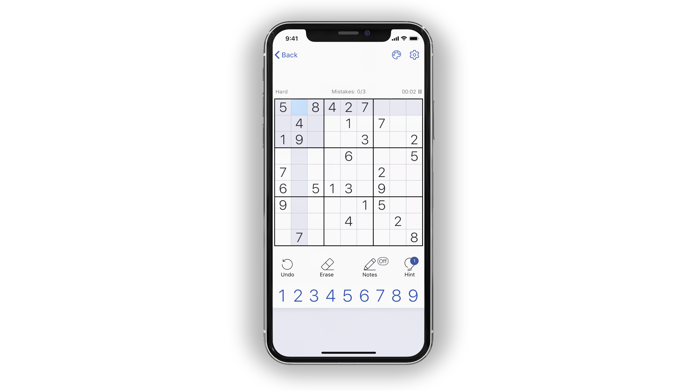
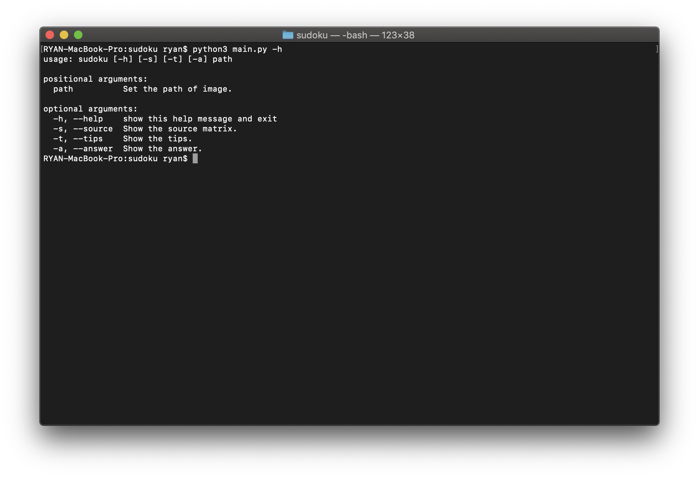
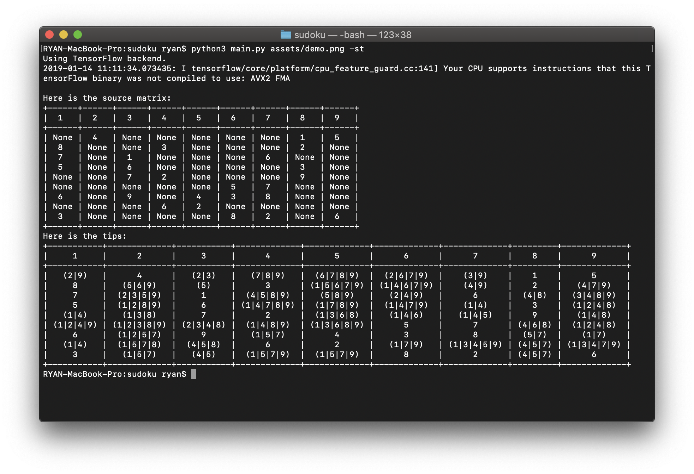
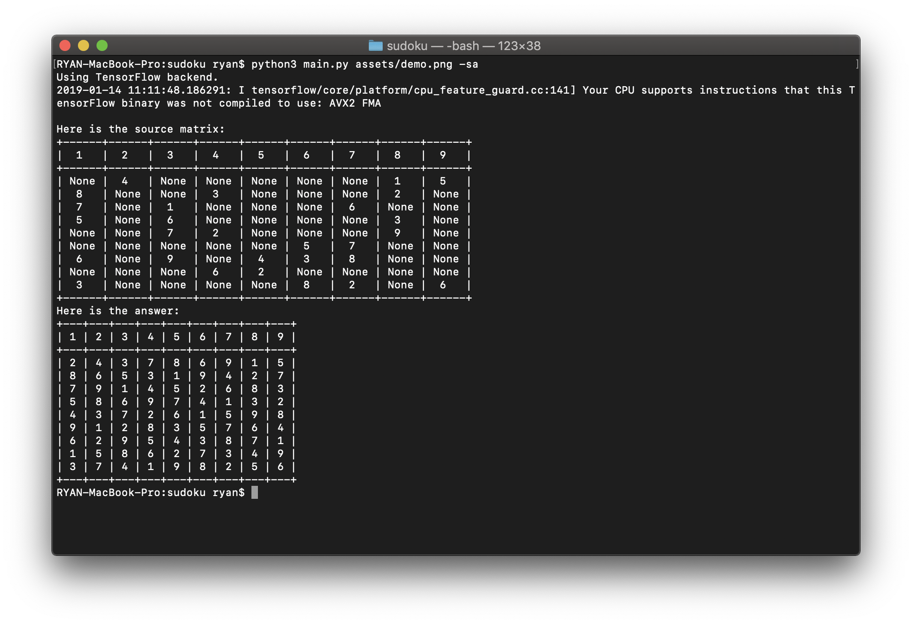

# Sudoku

Get tips or answer from iOS app [Sudoku](https://itunes.apple.com/cn/app/sudoku-com-classic-puzzle/id1193508329?l=en&mt=8).

I have no idea why I am so addicted to playing sudoku on my cell phone recently, so I create a CLI utility to help me save my time. 😂

It is created to transfer an image from the app to a sudoku matrix, then show the tips or answer on the terminal.

## Installation

**NOTE**: Python 3.6 or higher is required.

```
# clone the repo
$ git clone https://github.com/ryanfwy/sudoku.git

# change the working directory to sudoku
$ cd sudoku

# install the requirements
$ pip3 install -r requirements.txt
```

## Usages

First, drop the screenshot from your cell phone to computer.

Second, run `main.py` on the terminal. Ensure that all the requirements are installed.



`-s`: Show the source matrix.  
`-t`: Show the tips.
`-a`: Show the answer.

**NOTE**: **ONLY** the exactly iOS app [Sudoku](https://itunes.apple.com/cn/app/sudoku-com-classic-puzzle/id1193508329?l=en&mt=8) will work.

## Requirements

- `Keras + TensorFlow`: for number recognition.
- `Numpy`: for basic scientific computing.
- `OpenCV`: for image processing.
- `Prettytable`: print the matrix as a table.

## Reference

The sudoku algorithm is referenced on an answer from [Algorithm for solving Sudoku -- Stack Overflow](https://stackoverflow.com/questions/1697334/algorithm-for-solving-sudoku).
